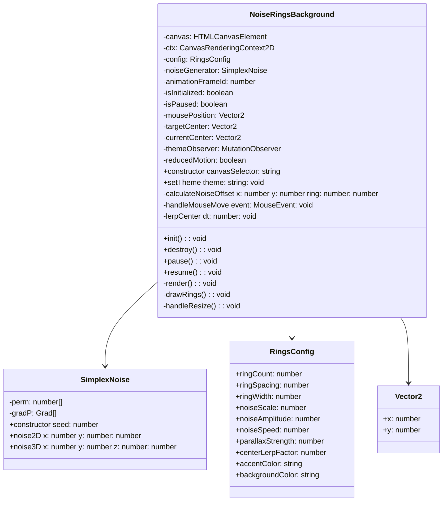
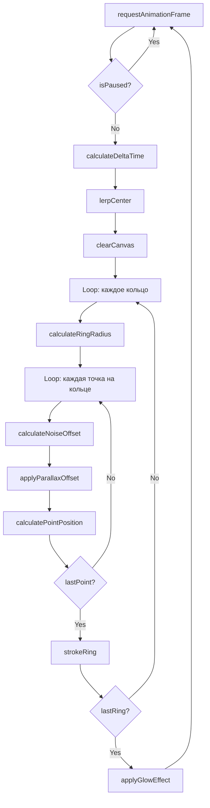
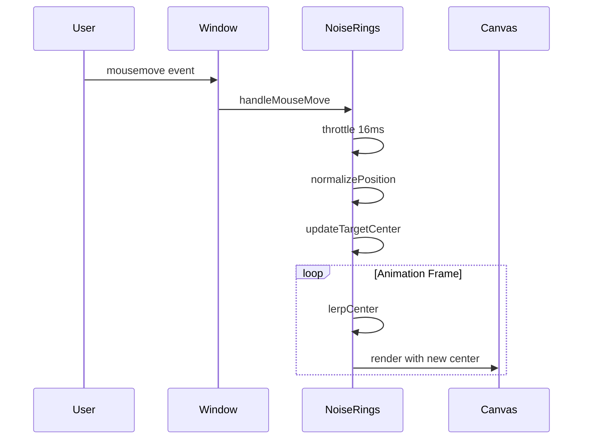
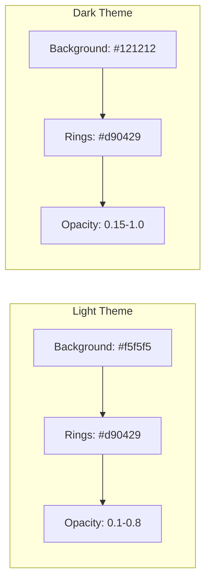
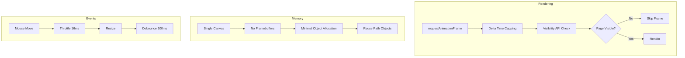

# Архитектура компонента NoiseRingsBackground

## Обзор

Компонент `NoiseRingsBackground` — это производительная альтернатива текущему WebGL-based `FluidBackground`. Эффект представляет собой концентрические кольца с шумовой деформацией (Perlin/Simplex noise), создающие визуальный эффект глубины/воронки.

### Ключевые преимущества перед FluidBackground

| Аспект | FluidBackground (WebGL) | NoiseRingsBackground (Canvas 2D) |
|--------|-------------------------|----------------------------------|
| Потребление памяти | Высокое (множество framebuffers) | Низкое (один canvas) |
| Нагрузка на GPU | Высокая (fluid simulation) | Низкая (простое рисование) |
| Совместимость | WebGL2/WebGL1 | Любой браузер с Canvas |
| Сложность кода | ~3400 строк | ~400-500 строк |
| Визуальный эффект | Динамическая жидкость | Статичные кольца с анимацией |

---

## Архитектура классов



---

## Структура класса NoiseRingsBackground

### Публичный API

```javascript
class NoiseRingsBackground {
  /**
   * @param {string} canvasSelector - CSS селектор canvas элемента
   */
  constructor(canvasSelector = '.fluid-background-canvas') {}
  
  /**
   * Инициализация компонента
   * @returns {void}
   */
  init() {}
  
  /**
   * Уничтожение компонента и освобождение ресурсов
   * @returns {void}
   */
  destroy() {}
  
  /**
   * Пауза анимации
   * @returns {void}
   */
  pause() {}
  
  /**
   * Возобновление анимации
   * @returns {void}
   */
  resume() {}
  
  /**
   * Обновление цветовой схемы
   * @param {Object} colors - Объект с цветами accent и background
   */
  updateColors(colors) {}
}
```

### Приватные свойства

```javascript
// Canvas и контекст
this.canvas = null;
this.ctx = null;

// Состояние анимации
this.animationFrameId = null;
this.isInitialized = false;
this.isPaused = false;
this.lastFrameTime = 0;
this.time = 0;

// Генератор шума
this.noiseGenerator = null;

// Позиция мыши и центр эффекта
this.mousePosition = { x: 0.5, y: 0.5 };      // Нормализованная позиция мыши
this.targetCenter = { x: 0.5, y: 0.5 };       // Целевой центр колец
this.currentCenter = { x: 0.5, y: 0.5 };      // Текущий центр (с интерполяцией)

// Система тем
this.themeObserver = null;
this.currentColors = {
  accent: '#d90429',
  background: '#121212'
};

// Доступность
this.reducedMotion = false;

// Конфигурация
this.config = {
  // Параметры колец
  ringCount: 25,              // Количество колец
  ringSpacing: 40,            // Расстояние между кольцами в пикселях
  ringWidth: 1.5,             // Толщина линии кольца
  
  // Параметры шума
  noiseScale: 0.003,          // Масштаб шума (меньше = плавнее)
  noiseAmplitude: 30,         // Амплитуда деформации в пикселях
  noiseSpeed: 0.0003,         // Скорость анимации шума
  noiseOctaves: 2,            // Количество октав шума
  
  // Параллакс
  parallaxStrength: 0.15,     // Сила смещения центра (0-1)
  centerLerpFactor: 0.08,     // Скорость интерполяции центра
  
  // Визуал
  fadeStart: 0.6,             // Начало затухания opacity (0-1 от центра)
  fadeEnd: 1.0,               // Конец затухания opacity
  glowIntensity: 0.3          // Интенсивность свечения
};
```

---

## Алгоритм рендеринга колец

### Процесс рендеринга



### Алгоритм расчета точки кольца

```javascript
/**
 * Вычисляет позицию точки на кольце с учетом шума и параллакса
 * @param {number} ringIndex - Индекс кольца (0 = центр)
 * @param {number} angle - Угол точки в радианах (0-2π)
 * @param {number} time - Текущее время анимации
 * @returns {Object} - {x, y} координаты точки
 */
calculatePointPosition(ringIndex, angle, time) {
  const centerX = this.canvas.width * this.currentCenter.x;
  const centerY = this.canvas.height * this.currentCenter.y;
  
  // Базовый радиус кольца
  const baseRadius = ringIndex * this.config.ringSpacing;
  
  // Шумовая деформация
  // Используем 3D noise: x,y для позиции, z для времени
  const noiseX = Math.cos(angle) * this.config.noiseScale * baseRadius;
  const noiseY = Math.sin(angle) * this.config.noiseScale * baseRadius;
  const noiseValue = this.noiseGenerator.noise3D(
    noiseX,
    noiseY,
    time * this.config.noiseSpeed + ringIndex * 0.1
  );
  
  // Амплитуда зависит от удаленности от центра
  const distanceFactor = ringIndex / this.config.ringCount;
  const amplitude = this.config.noiseAmplitude * (0.5 + distanceFactor * 0.5);
  
  // Финальный радиус с деформацией
  const radius = baseRadius + noiseValue * amplitude;
  
  // Координаты точки
  return {
    x: centerX + Math.cos(angle) * radius,
    y: centerY + Math.sin(angle) * radius
  };
}
```

### Рисование кольца

```javascript
/**
 * Рисует одно кольцо
 * @param {number} ringIndex - Индекс кольца
 * @param {number} time - Текущее время
 */
drawRing(ringIndex, time) {
  const segments = 120; // Количество сегментов для плавности
  const angleStep = (Math.PI * 2) / segments;
  
  // Вычисление opacity с затуханием к краям
  const distanceFactor = ringIndex / this.config.ringCount;
  const opacity = this.calculateOpacity(distanceFactor);
  
  if (opacity <= 0) return;
  
  this.ctx.beginPath();
  this.ctx.strokeStyle = this.hexToRgba(
    this.currentColors.accent,
    opacity
  );
  this.ctx.lineWidth = this.config.ringWidth;
  
  let firstPoint = null;
  
  for (let i = 0; i <= segments; i++) {
    const angle = i * angleStep;
    const point = this.calculatePointPosition(ringIndex, angle, time);
    
    if (i === 0) {
      this.ctx.moveTo(point.x, point.y);
      firstPoint = point;
    } else {
      this.ctx.lineTo(point.x, point.y);
    }
  }
  
  // Замыкаем кольцо
  if (firstPoint) {
    this.ctx.lineTo(firstPoint.x, firstPoint.y);
  }
  
  this.ctx.stroke();
}
```

---

## Система интерактивности

### Обработка движения мыши



### Реализация parallax-эффекта

```javascript
/**
 * Обработчик движения мыши
 * @param {MouseEvent} event
 */
handleMouseMove(event) {
  // Throttling
  const now = performance.now();
  if (now - this.lastMouseMoveTime < 16) return;
  this.lastMouseMoveTime = now;
  
  // Нормализация позиции мыши (0-1)
  this.mousePosition.x = event.clientX / window.innerWidth;
  this.mousePosition.y = event.clientY / window.innerHeight;
  
  // Расчет целевого центра с parallax смещением
  // Центр смещается в сторону, противоположную позиции мыши
  const offsetX = (0.5 - this.mousePosition.x) * this.config.parallaxStrength;
  const offsetY = (0.5 - this.mousePosition.y) * this.config.parallaxStrength;
  
  this.targetCenter.x = 0.5 + offsetX;
  this.targetCenter.y = 0.5 + offsetY;
}

/**
 * Плавная интерполяция центра к целевой позиции
 * @param {number} dt - Delta time в секундах
 */
lerpCenter(dt) {
  const factor = 1 - Math.pow(1 - this.config.centerLerpFactor, dt * 60);
  
  this.currentCenter.x += (this.targetCenter.x - this.currentCenter.x) * factor;
  this.currentCenter.y += (this.targetCenter.y - this.currentCenter.y) * factor;
}
```

### Дополнительные эффекты при движении мыши

```javascript
/**
 * Расчет дополнительной деформации вблизи курсора
 * @param {number} pointX - X координата точки
 * @param {number} pointY - Y координата точки
 * @returns {number} - Дополнительное смещение радиуса
 */
calculateCursorInfluence(pointX, pointY) {
  const mouseX = this.mousePosition.x * this.canvas.width;
  const mouseY = this.mousePosition.y * this.canvas.height;
  
  const dx = pointX - mouseX;
  const dy = pointY - mouseY;
  const distance = Math.sqrt(dx * dx + dy * dy);
  
  // Радиус влияния курсора
  const influenceRadius = 150;
  
  if (distance > influenceRadius) return 0;
  
  // Плавное затухание влияния
  const influence = 1 - (distance / influenceRadius);
  const smoothInfluence = influence * influence * (3 - 2 * influence); // smoothstep
  
  return smoothInfluence * 20; // Максимальное смещение в пикселях
}
```

---

## Интеграция с системой тем

### Наблюдение за изменением темы

```javascript
/**
 * Инициализация наблюдателя за темой
 */
initThemeObserver() {
  // Получение начальных цветов
  this.updateColorsFromCSS();
  
  // Наблюдение за изменением data-theme атрибута
  this.themeObserver = new MutationObserver(() => {
    this.updateColorsFromCSS();
  });
  
  this.themeObserver.observe(document.documentElement, {
    attributes: true,
    attributeFilter: ['data-theme']
  });
}

/**
 * Обновление цветов из CSS переменных
 */
updateColorsFromCSS() {
  const computedStyle = getComputedStyle(document.documentElement);
  
  // Получаем accent цвет
  let accentColor = computedStyle.getPropertyValue('--color-accent').trim();
  if (!accentColor) {
    accentColor = '#d90429'; // Fallback
  }
  
  // Получаем цвет фона
  let bgColor = computedStyle.getPropertyValue('--color-bg-primary').trim();
  if (!bgColor) {
    bgColor = '#121212'; // Fallback для темной темы
  }
  
  this.currentColors = {
    accent: accentColor,
    background: bgColor
  };
}
```

### Цветовая схема



---

## Оптимизации производительности

### Стратегии оптимизации



### Детали реализации

```javascript
/**
 * Основной цикл рендеринга с оптимизациями
 */
render() {
  if (!this.isInitialized || this.isPaused) {
    return;
  }
  
  // Visibility API - пропуск рендеринга для скрытых вкладок
  if (document.hidden) {
    this.animationFrameId = requestAnimationFrame(() => this.render());
    return;
  }
  
  const now = performance.now();
  const dt = Math.min((now - this.lastFrameTime) / 1000, 0.033); // Cap at 30fps minimum
  this.lastFrameTime = now;
  this.time += dt;
  
  // Интерполяция центра
  this.lerpCenter(dt);
  
  // Очистка canvas
  this.ctx.clearRect(0, 0, this.canvas.width, this.canvas.height);
  
  // Рисование колец от внешних к внутренним (для правильного наложения)
  for (let i = this.config.ringCount; i >= 1; i--) {
    this.drawRing(i, this.time);
  }
  
  // Следующий кадр
  this.animationFrameId = requestAnimationFrame(() => this.render());
}
```

### Оптимизация для reduced motion

```javascript
/**
 * Проверка и применение режима reduced motion
 */
checkReducedMotion() {
  this.reducedMotion = window.matchMedia(
    '(prefers-reduced-motion: reduce)'
  ).matches;
  
  if (this.reducedMotion) {
    // Отключаем анимацию, показываем статичные кольца
    this.config.noiseSpeed = 0;
    this.config.parallaxStrength = 0;
    
    // Рисуем один раз и останавливаемся
    this.renderStaticFrame();
    return;
  }
}

/**
 * Рендеринг статичного кадра для reduced motion
 */
renderStaticFrame() {
  this.ctx.clearRect(0, 0, this.canvas.width, this.canvas.height);
  
  for (let i = this.config.ringCount; i >= 1; i--) {
    this.drawRing(i, 0); // time = 0 для статичного шума
  }
}
```

### Throttling и Debouncing

```javascript
// Throttled mouse move
this.lastMouseMoveTime = 0;
this.mouseMoveThrottleDelay = 16; // ~60fps

// Debounced resize
this.resizeTimeout = null;
this.resizeDebounceDelay = 100;

handleResize() {
  if (this.resizeTimeout) {
    clearTimeout(this.resizeTimeout);
  }
  
  this.resizeTimeout = setTimeout(() => {
    this.canvas.width = window.innerWidth * window.devicePixelRatio;
    this.canvas.height = window.innerHeight * window.devicePixelRatio;
    this.ctx.scale(window.devicePixelRatio, window.devicePixelRatio);
    
    // Пересчет параметров под новый размер
    this.recalculateConfig();
  }, this.resizeDebounceDelay);
}
```

---

## Simplex Noise реализация

### Встроенный генератор шума

```javascript
/**
 * Simplex Noise генератор
 * Легковесная реализация для 2D/3D шума
 */
class SimplexNoise {
  constructor(seed = Math.random()) {
    this.p = this.buildPermutationTable(seed);
    this.perm = new Uint8Array(512);
    this.permMod12 = new Uint8Array(512);
    
    for (let i = 0; i < 512; i++) {
      this.perm[i] = this.p[i & 255];
      this.permMod12[i] = this.perm[i] % 12;
    }
  }
  
  buildPermutationTable(seed) {
    const p = new Uint8Array(256);
    for (let i = 0; i < 256; i++) {
      p[i] = i;
    }
    
    // Fisher-Yates shuffle с seed
    let n = 256;
    while (n > 1) {
      seed = (seed * 16807) % 2147483647;
      const k = (seed % n);
      n--;
      [p[n], p[k]] = [p[k], p[n]];
    }
    
    return p;
  }
  
  /**
   * 2D Simplex Noise
   * @param {number} x
   * @param {number} y
   * @returns {number} Значение от -1 до 1
   */
  noise2D(x, y) {
    // Реализация 2D simplex noise
    // ... (стандартный алгоритм)
  }
  
  /**
   * 3D Simplex Noise (для анимации)
   * @param {number} x
   * @param {number} y
   * @param {number} z
   * @returns {number} Значение от -1 до 1
   */
  noise3D(x, y, z) {
    // Реализация 3D simplex noise
    // ... (стандартный алгоритм)
  }
}
```

---

## Файловая структура

```
src/js/components/background-effect/
├── FluidBackground.js          # Существующий (будет сохранен)
├── NoiseRingsBackground.js     # Новый компонент
├── SimplexNoise.js             # Генератор шума (можно встроить)
└── index.js                    # Экспорты

src/scss/components/
├── _fluid-background.scss      # Существующие стили (переиспользуем)
└── _noise-rings.scss           # Новые стили (если потребуется)
```

---

## Интеграция с IndexPage

### Изменения в IndexPage.js

```javascript
// Было:
import { FluidBackground } from '../components/background-effect/FluidBackground.js';

// Станет:
import { NoiseRingsBackground } from '../components/background-effect/NoiseRingsBackground.js';

// В методе init():
this.backgroundEffect = new NoiseRingsBackground('.fluid-background-canvas');
this.backgroundEffect.init();
```

### Переключаемая реализация (опционально)

```javascript
/**
 * Фабрика для создания фонового эффекта
 * Позволяет переключаться между реализациями
 */
function createBackgroundEffect(type = 'noise-rings') {
  const canvas = '.fluid-background-canvas';
  
  switch (type) {
    case 'fluid':
      return new FluidBackground(canvas);
    case 'noise-rings':
    default:
      return new NoiseRingsBackground(canvas);
  }
}
```

---

## План тестирования

### Функциональные тесты

- [ ] Инициализация компонента на различных размерах экрана
- [ ] Корректное отображение колец с деформацией
- [ ] Плавная анимация шума
- [ ] Parallax эффект при движении мыши
- [ ] Смена цветов при переключении темы
- [ ] Корректная работа reduced motion
- [ ] Пауза/возобновление при скрытии вкладки

### Тесты производительности

- [ ] FPS >= 60 на современных устройствах
- [ ] FPS >= 30 на мобильных устройствах
- [ ] Отсутствие memory leaks при длительной работе
- [ ] Корректная очистка ресурсов при destroy()

### Кроссбраузерное тестирование

- [ ] Chrome/Edge (Chromium)
- [ ] Firefox
- [ ] Safari
- [ ] Mobile Safari (iOS)
- [ ] Chrome Mobile (Android)

---

## Чеклист реализации

- [ ] Создать файл `NoiseRingsBackground.js`
- [ ] Реализовать класс `SimplexNoise` (или использовать библиотеку)
- [ ] Реализовать основной класс `NoiseRingsBackground`
- [ ] Добавить систему рендеринга колец
- [ ] Реализовать шумовую деформацию
- [ ] Добавить обработку мыши и parallax
- [ ] Интегрировать наблюдатель за темой
- [ ] Добавить поддержку reduced motion
- [ ] Оптимизировать производительность
- [ ] Добавить стили в SCSS (если необходимо)
- [ ] Обновить `IndexPage.js` для использования нового компонента
- [ ] Протестировать на различных устройствах
- [ ] Написать документацию API

---

## Примечания

1. **Сохранение FluidBackground**: Рекомендуется сохранить `FluidBackground.js` как альтернативу для пользователей, предпочитающих динамический fluid-эффект.

2. **Конфигурируемость**: Все параметры эффекта вынесены в объект `config`, что позволяет легко настраивать визуал без изменения кода.

3. **Совместимость со стилями**: Компонент использует тот же CSS класс `.fluid-background-canvas`, что позволяет переиспользовать существующие стили.

4. **Безопасный fallback**: При отсутствии поддержки Canvas 2D или при ошибках инициализации компонент не ломает страницу.
